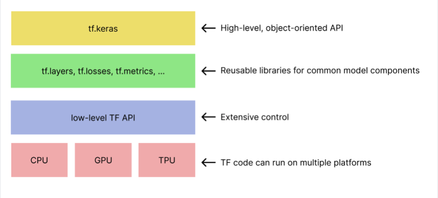

# Google Machine Learning Crash Course

 [Course Link](https://developers.google.com/machine-learning/crash-course/ml-intro)

## Framing: Key ML Terminology

* ML systems learn how to combine input to produce useful predictions on never-before-seen data.

### Labels

A label is the thing we're predicting—the y variable in simple linear regression. The label could be the future price of wheat, the kind of animal shown in a picture, the meaning of an audio clip, or just about anything.

### Features

A feature is an input variable—the x variable in simple linear regression. A simple machine learning project might use a single feature, while a more sophisticated machine learning project could use millions of features, 

* In the spam detector example, the features could include the following:

    * words in the email text
    * sender's address
    * time of day the email was sent
    * email contains the phrase "one weird trick."

### Examples

An example is a particular instance of data, x. (We put x in boldface to indicate that it is a vector.) We break examples into two categories:

#### labeled examples

A labeled example includes both feature(s) and the label. That is:

```
labeled examples: {features, label}: (x, y)
```

Use labeled examples to train the model. In our spam detector example, the labeled examples would be individual emails that users have explicitly marked as "spam" or "not spam."


#### unlabeled examples

An unlabeled example contains features but not the label. That is:

```
unlabeled examples: {features, ?}: (x, ?)
```

### Models

A model defines the relationship between features and label. For example, a spam detection model might associate certain features strongly with "spam". Let's highlight two phases of a model's life:

* **Training** means creating or learning the model. That is, you show the model labeled examples and enable the model to gradually learn the relationships between features and label.

* **Inference** means applying the trained model to unlabeled examples. That is, you use the trained model to make useful predictions (y'). For example, during inference, you can predict medianHouseValue for new unlabeled examples.

### Regression vs Classification

1. A regression model predicts continuous values. For example, regression models make predictions that answer questions like the following:

* What is the value of a house in California?
* What is the probability that a user will click on this ad?

2. A classification model predicts discrete values. For example, classification models make predictions that answer questions like the following:

* Is a given email message spam or not spam?
* Is this an image of a dog, a cat, or a hamster?

## Descending into ML

**Training** a model simply means learning (determining) good values for all the weights and the bias from labeled examples.

**Mean square error (MSE)** is the average squared loss per example over the whole dataset. 

## Reducing Loss:Gradient Descent

**Hyperparameters** are the knobs that programmers tweak in machine learning algorithms.

## Introduction to TensorFlow



### Linear Regression with Synthetic Data

**Summary of hyperparameter tuning**
Most machine learning problems require a lot of hyperparameter tuning. Unfortunately, we can't provide concrete tuning rules for every model. Lowering the learning rate can help one model converge efficiently but make another model converge much too slowly. You must experiment to find the best set of hyperparameters for your dataset. That said, here are a few rules of thumb:

* Training loss should steadily decrease, steeply at first, and then more slowly until the slope of the curve reaches or approaches zero.
* If the training loss does not converge, train for more epochs.
* If the training loss decreases too slowly, increase the learning rate. Note that setting the learning rate too high may also prevent training loss from converging.
* If the training loss varies wildly (that is, the training loss jumps around), decrease the learning rate.
* Lowering the learning rate while increasing the number of epochs or the batch size is often a good combination.
* Setting the batch size to a very small batch number can also cause instability. First, try large batch size values. Then, decrease the batch size until you see degradation.
* For real-world datasets consisting of a very large number of examples, the entire dataset might not fit into memory. In such cases, you'll need to reduce the batch size to enable a batch to fit into memory.

**Remember: the ideal combination of hyperparameters is data dependent, so you must always experiment and verify.**


A **correlation matrix** indicates how each attribute's raw values relate to the other attributes' raw values. Correlation values have the following meanings:

* 1.0: perfect positive correlation; that is, when one attribute rises, the other attribute rises.
* -1.0: perfect negative correlation; that is, when one attribute rises, the other attribute falls.
* 0.0: no correlation; the two columns are not linearly related.

In general, the higher the absolute value of a correlation value, the greater its predictive power. For example, a correlation value of -0.8 implies far more predictive power than a correlation of -0.2.

