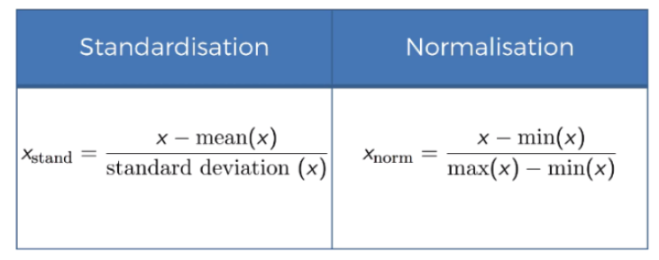

# Part1 Data Pre-Processing

## Machine Learning process

### Data Pre-Processing

* Import the data
* Clean the data
* Split into training & test sets.
* Feature Scaling

### Modelling 

* Build the model 
* Train the model
* Make predictions

### Evaluation
* Calculate perfomance metrics
* Make a verdict

## Feature Scalling Basic




## Data Pre-Processing Template

### Importing the libraries

```
import numpy as np
import pandas as pd
import matplotlib as plt
```

### Import the dataset

```
dataset = pd.read_csv('data.csv')
## Not include last column
X = dataset.iloc[:, :-1]
## only include last column
y = dataset.iloc[:, -1]
```

### Spliting the dataset into the Training set and Test set

```
from sklearn.model_selection import train_test_split
X_train, X_test, y_train, y_test = train_test_split(X, y, test_size = 0.2, random_state = 0)
```
### Featur Scaling
```
from sklearn.preprocessing import StandardScaler
sc = StandardScaler()
X_train = sc.fit_transform(X_train)
X_test = sc.transform(X_test)
```

