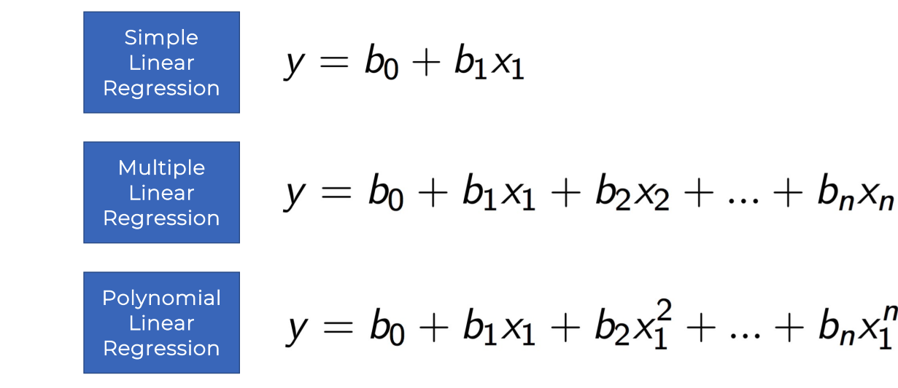
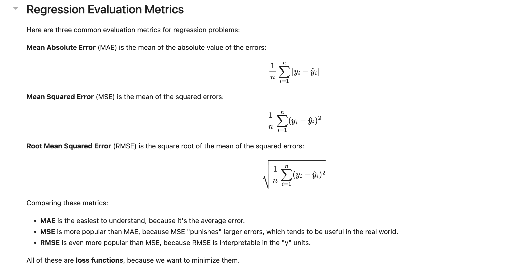
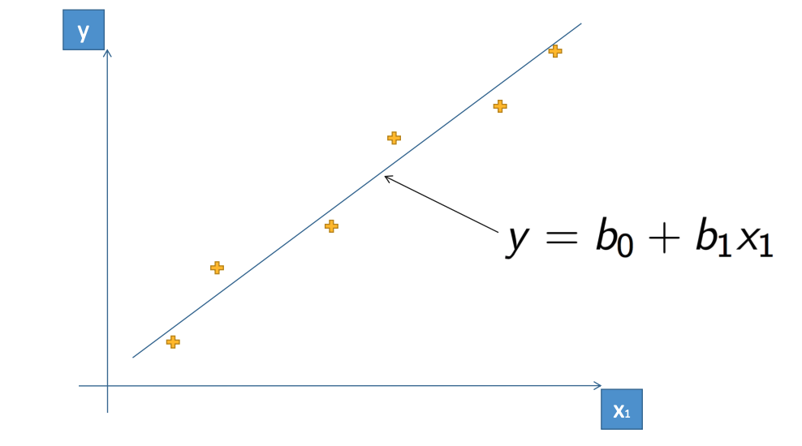
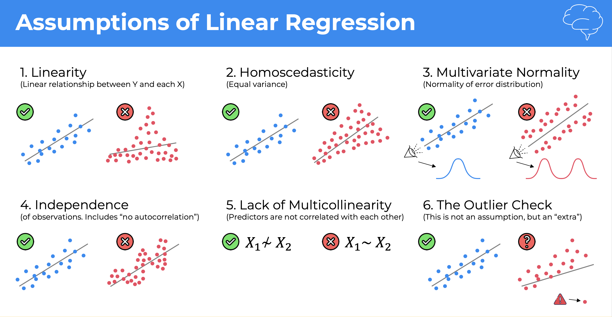
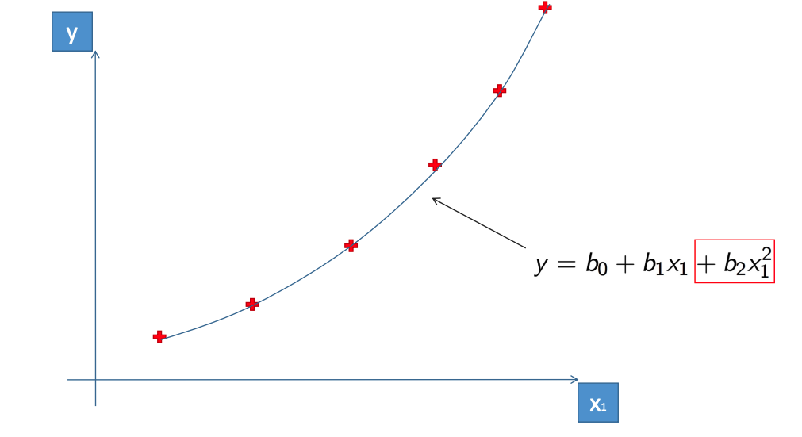

# Regression

##  Machine Learning Regression models

* Simple Linear Regression

* Multiple Linear Regression

* Polynomial Regression

* Support Vector for Regression (SVR)

* Decision Tree Regression

* Random Forest Regression

## Regression evaluation metrics
Based on the differences between the predicted and actual values, you can calculate some common metrics that are used to evaluate a regression model.

### Mean Absolute Error (MAE)
The variance in this example indicates by how many ice creams each prediction was wrong. It doesn't matter if the prediction was over or under the actual value (so for example, -3 and +3 both indicate a variance of 3). This metric is known as the absolute error for each prediction, and can be summarized for the whole validation set as the mean absolute error (MAE).

### Mean Squared Error (MSE)
The mean absolute error metric takes all discrepancies between predicted and actual labels into account equally. However, it may be more desirable to have a model that is consistently wrong by a small amount than one that makes fewer, but larger errors. One way to produce a metric that "amplifies" larger errors by squaring the individual errors and calculating the mean of the squared values. This metric is known as the mean squared error (MSE).

### Root Mean Squared Error (RMSE)
The mean squared error helps take the magnitude of errors into account, but because it squares the error values, the resulting metric no longer represents the quantity measured by the label. In other words, we can say that the MSE of our model is 6, but that doesn't measure its accuracy in terms of the number of ice creams that were mispredicted; 6 is just a numeric score that indicates the level of error in the validation predictions.

## Simple Linear Regression

* [Simple Linear Regression Sample Code](https://drive.google.com/file/d/1831I5KalbB51uj5Rqxr8TNsGwVj61Gk5/view?usp=drive_link)

## Multiple Linear Regression

* [Multiple Linear Regression Sample Code](https://drive.google.com/file/d/194DHS6ARmvcJaAq8keNLeWPP9SN-V8Ab/view?usp=drive_link)

## Polynomial Regression

* [Polynomial Linear Regression Sample Code](https://drive.google.com/file/d/1neBn8KXLMxHJHVfoSIvuJfS6QrFWUeEg/view?usp=drive_link)

## Support Vector Regression (SVR)

