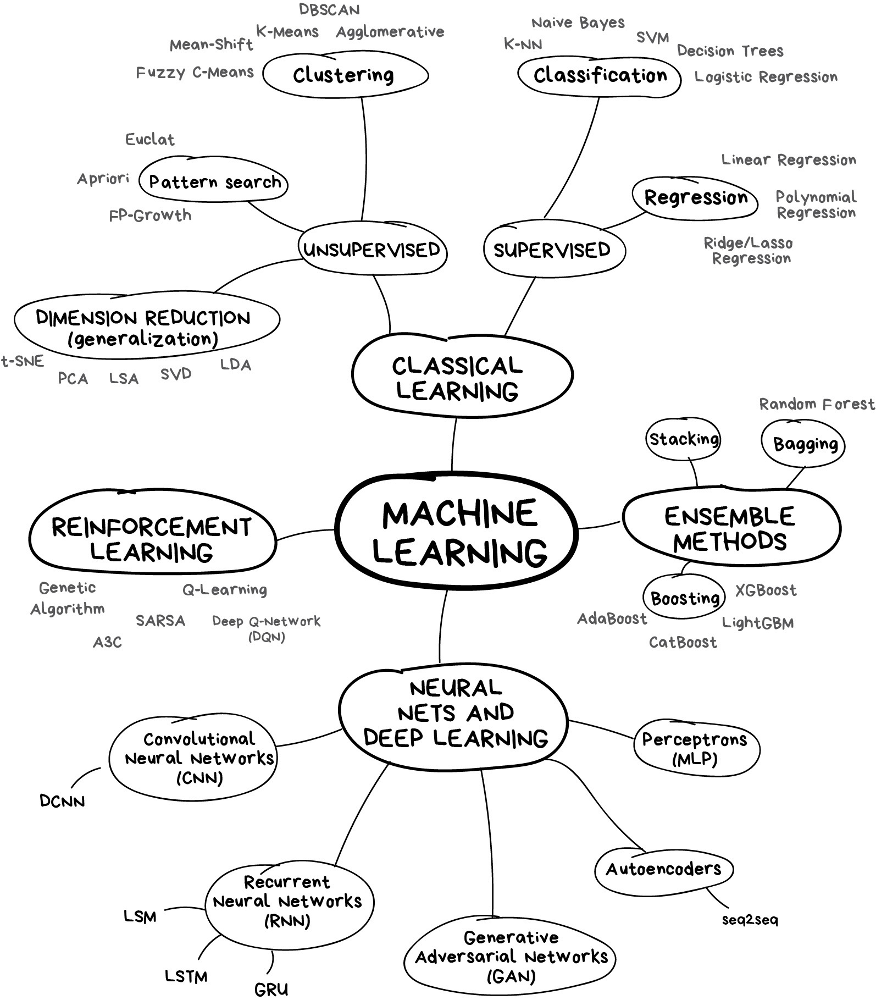
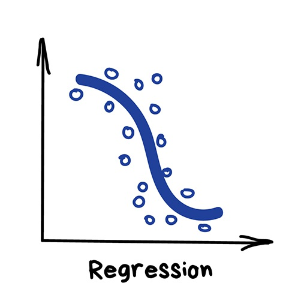

# Core Concept of Machine Learning 

## Machine Learning for Everyone [Blog link](https://vas3k.com/blog/machine_learning/index.html)

### Three components of machine learning

* Data 
* Features
* Algorithms 

### Learning vs Intelligence

* **Aritificial intelligence** is the name of a whole knowledge field, similar to biology or chemistry

* **Machine Learning** is a part of artificial intelligence. An important part, but not the only one. 

* **Neural Networks** are one of machine learning types. A popular one, but there are other good guys in the class.

* **Deep Learning** is a modern method of building, training, and using neural networks. 

### The map of the machine learning world

* Full view of machine learning

* Four main directions in machine learning

### Part 1. Classic Machine Learning

### 1.1 Supervised Learning

the machine has a "supervisor" or a "teacher" who gives the machine all the answers, like whether it's a cat in the picture or a dog. The teacher has already divided (labeled) the data into cats and dogs, and the machine is using these examples to learn. One by one. Dog by cat.

* There are two types of such tasks: classification – an object's category prediction, and regression – prediction of a specific point on a numeric axis.

#### Classifications

* "Splits objects based at one of the attributes known beforehand. Separate socks by based on color, documents based on language, music by genre"

* Today used for:
    * Spam filtering
    * Language detection
    * A search of similar documents
    * Sentiment analysis
    * Recognition of handwritten characters and numbers
    * Fraud detection

* Popular algorithms:
    * Naive Bayes
    * Decision Tree
    * Logistic Regression
    * K-Nearest Neighbours
    * Support Vector Machine

* Support Vector Machines (SVM) is rightfully the most popular method of classical classification. It was used to classify everything in existence: plants by appearance in photos, documents by categories, etc.

#### Regression

* "Draw a line through these dots. Yep, that's the machine learning"

* Today this is used for:

    * Stock price forecasts
    * Demand and sales volume analysis
    * Medical diagnosis
    * Any number-time correlations
* Popular algorithms are linear and Polynomial regressions.

### 1.2 Unsupervised Learning

#### Clustering

* "Divides objects based on unknown features. Machine chooses the best way"

* Nowadays used:

    * For market segmentation (types of customers, loyalty)
    * To merge close points on a map
    * For image compression
    * To analyze and label new data
    * To detect abnormal behavior

popular algorithms: K-means_clustering, Mean-Shift, DBSCAN
* [The 5 Clustering Algorithms Data Scientists Need to Know](https://towardsdatascience.com/the-5-clustering-algorithms-data-scientists-need-to-know-a36d136ef68)

#### Dimensionality-Reduction(Generalization)
* "Assembles specific features into more high-level ones"

* Nowadays is used for:

    * Recommender systems (★)
    * Beautiful visualizations
    * Topic modeling and similar document search
    * Fake image analysis
    * Risk management

* Popular algorithms: Principal Component Analysis (PCA), Singular Value Decomposition (SVD), Latent Dirichlet allocation (LDA), Latent Semantic Analysis (LSA, pLSA, GLSA), t-SNE (for visualization)